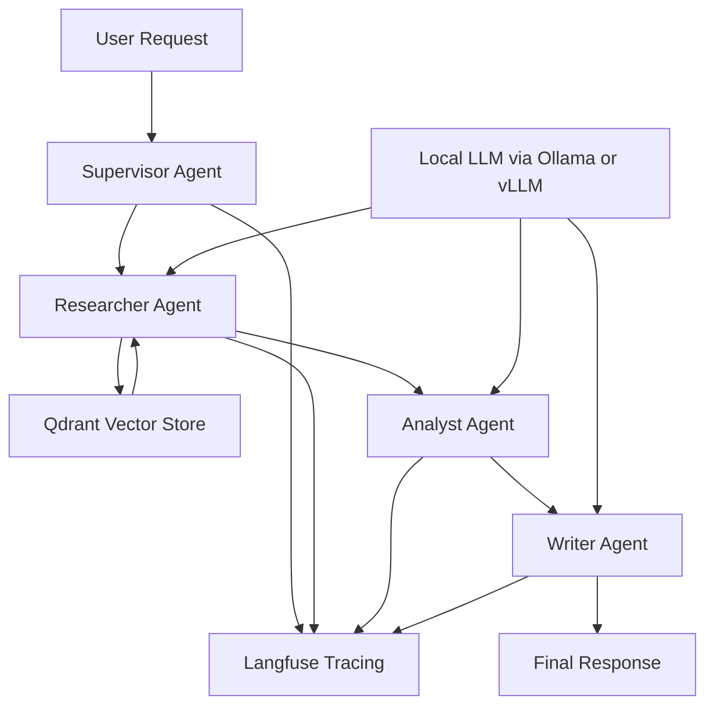

# Project 3: Self-Hosted Multi-Agent System

A self-hosted multi-agent orchestration project for Deal Desk and Incident Response workflows using a Supervisor pattern with LangGraph. It combines a local vector retrieval layer with a local LLM serving layer and Langfuse-based observability.

## Architecture Overview



## Core Components

- LangGraph: supervisor orchestration across specialist agents
- Qdrant: semantic retrieval for incident and policy knowledge
- Ollama or vLLM: local inference layer for open-source models such as Llama 3.1 or Qwen
- Langfuse: tracing of agent steps, tool calls, latency, and errors
- Python: orchestration, retrieval abstraction, and workflow execution

## Suggested Execution Flow

1. Start the local infrastructure stack:
   ```bash
   docker compose up -d
   ```
2. Copy the environment file:
   ```bash
   cp .env.example .env
   ```
3. Update model and endpoint values in `.env` if needed.
4. Install Python dependencies:
   ```bash
   python -m pip install -r requirements.txt
   ```
5. Run the workflow:
   ```bash
   python main.py "Investigate payment processing delay"
   ```

## Local Model Options

### Ollama
Best for local iteration and simpler deployment. Use a model such as:

```bash
ollama pull llama3.1:8b-instruct-q4_0
```

Then point the project to:

```text
OLLAMA_BASE_URL=http://localhost:11434
MODEL_PROVIDER=ollama
MODEL_NAME=llama3.1:8b-instruct-q4_0
```

### vLLM
Best for throughput and production-like model serving. Run the OpenAI-compatible API server and point the app to:

```text
VLLM_BASE_URL=http://localhost:8000/v1
MODEL_PROVIDER=vllm
MODEL_NAME=meta-llama/Meta-Llama-3.1-8B-Instruct
```

## Qdrant Retrieval Notes

Qdrant stores semantic search indexes for incident knowledge, policy snippets, and deal desk precedent entries. The retrieval layer should:

- embed the user query,
- search for top-k matching documents,
- return concise evidence summaries to the Researcher,
- preserve source metadata for traceability.

## Langfuse Observability

Langfuse captures:

- request and response metadata,
- prompt and completion logs,
- tool call traces,
- latency and error events,
- per-agent workflow summaries.

This is especially useful in complex incident-response workflows, where each agent step needs to be replayable and auditable.

## Architecture Tradeoff: LangGraph vs CrewAI

### LangGraph
Pros:
- Native graph execution semantics
- Strong control over routing and retries
- Great fit for structured supervisor patterns
- Easy to trace in Langfuse

Cons:
- More orchestration code upfront
- Requires careful state management design
- Fewer "batteries included" abstractions than some agent frameworks

### CrewAI / similar frameworks
Pros:
- Faster setup for simple multi-agent demos
- Nice high-level role abstractions
- Less custom graph plumbing in initial prototypes

Cons:
- More opaque control flow
- Harder to tune state transitions and routing logic
- Typically less transparent for production observability and deterministic execution

## Recommended Production Enhancements

- Add explicit embeddings model configuration for Qdrant ingestion
- Add real document ingestion scripts for incident and deal-desk assets
- Add monitoring for prompt quality and retrieval recall
- Add support for tool-calling and structured outputs when using stronger models
- Add health checks and startup dependency ordering for local services

## Current Status

This repository includes the initial foundation for the project:

- Docker Compose stack for local infrastructure
- Python environment configuration
- Qdrant retrieval client wrapper
- Typed agent state models
- Specialist agents and supervisor-driven graph
- CLI runner for workflow execution

The next production step is to add real embeddings, ingestion pipelines, and model-backed tool calls while keeping the supervision pattern and Langfuse tracing intact.
